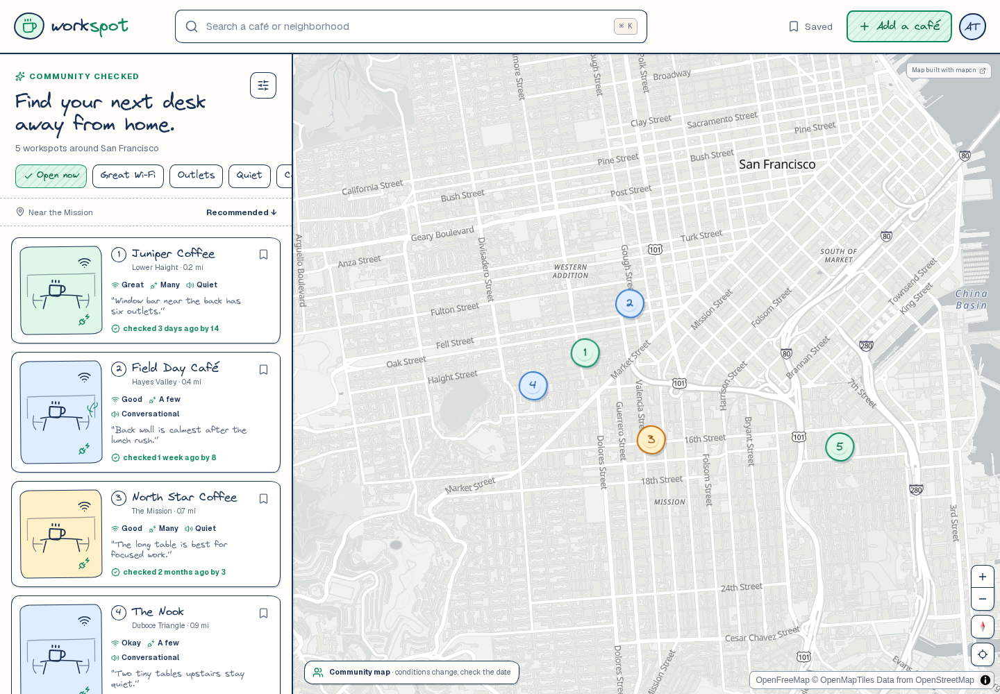
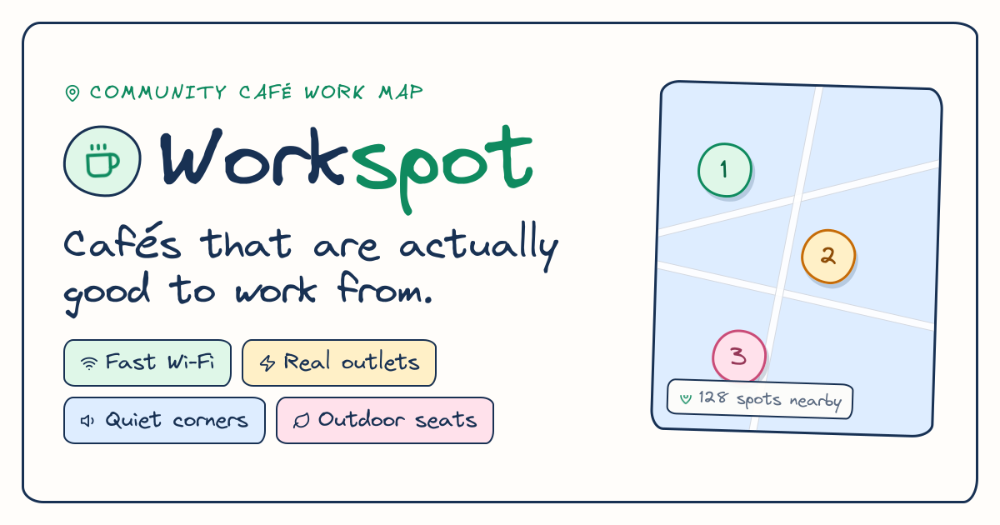

# workina.cafe

A hand-drawn community map for finding cafés that are actually good to work from.



## V1 features

- Responsive map and result list built with [mapcn](https://mapcn.dev) and MapLibre
- Excalidraw-inspired interface using the official Virgil font, rough borders, and hachure states
- Café search and filters for hours, Wi-Fi, outlets, noise, calls, and outdoor seating
- Linked card and marker hover/selection states
- Work-focused café details with freshness and community confirmation signals
- Four-step add-a-café flow that publishes a demo contribution into the current browser session
- Desktop sidebar and mobile bottom-sheet layouts
- Keyboard, reduced-motion, and accessible-label support
- Hand-drawn social preview card for Open Graph, Twitter/X, iMessage, Slack, and other link unfurls

Café records and community actions are demo data in V1. User accounts, saved places, persistence, geocoding, and moderation are intentionally deferred.

## Run locally

```bash
npm install
npm run dev
```

Open the local URL printed by Next.js.

## Validate

```bash
npm run lint
npx tsc --noEmit
npm run build
```

## Stack

- Next.js 16 and React 19
- TypeScript and Tailwind CSS 4
- mapcn and MapLibre GL
- OpenFreeMap basemap with OpenStreetMap data
- shadcn/ui primitives and Lucide icons

## Product artifacts

- [Product and UI plan](docs/cafe-work-map-plan.md)
- [Editable Excalidraw UX concept](docs/cafe-work-map-ux.excalidraw)
- [Rendered UX concept](docs/cafe-work-map-ux.png)

## Social preview

Link previews (Open Graph, Twitter/X, iMessage, Slack, LinkedIn, Discord) use a generated 1200×630 card rendered with `next/og` in the Virgil hand-drawn font.



- Renderer: `src/lib/og-image.tsx`
- Routes: `src/app/opengraph-image.tsx` and `src/app/twitter-image.tsx` (statically prerendered)
- Metadata wiring lives in `src/app/layout.tsx`. Set `NEXT_PUBLIC_SITE_URL` in production so the absolute image URLs resolve correctly.

The Virgil font is licensed under SIL Open Font License 1.1. Its license is included at `public/fonts/LICENSE-Virgil.md` (and `assets/LICENSE-Virgil.md` alongside the OG render font).
